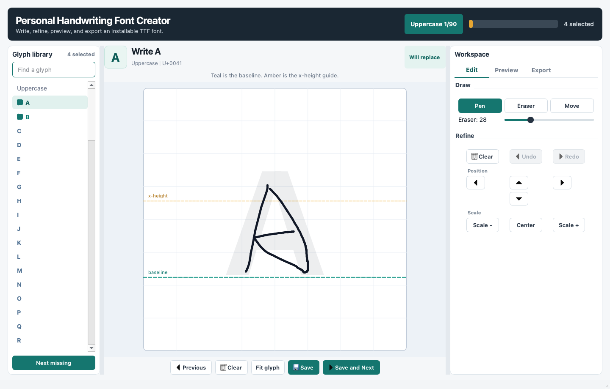
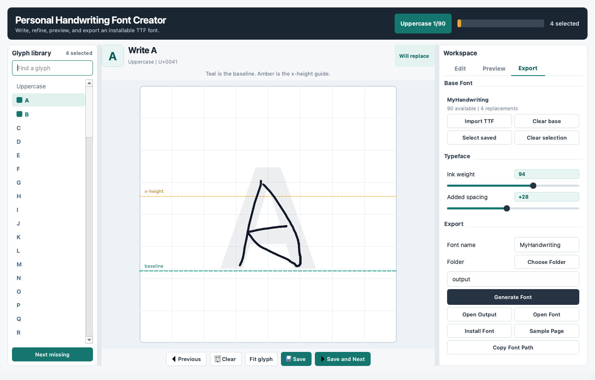

# Personal Handwriting Font Creator

Turn handwriting drawn in a desktop editor into a real installable TrueType font. Every character stays editable as vector stroke data until you export a `.ttf` file.



_Actual screenshot from the current desktop build. In base-font mode, checked glyphs are the only characters selected for replacement._

## Built For The Writing Loop

| In the editor | What it helps with |
| --- | --- |
| Glyph library with saved-state color | See what is ready, filter by character or Unicode codepoint, and jump to the next missing glyph. |
| Writing canvas | Draw with mouse or tablet, with baseline and x-height guides visible while writing. |
| Editing workspace | Pen, eraser, move, undo, redo, clear, scale, nudge, center, and one-click fit-to-guides. |
| Live preview | Type a sample phrase and inspect saved vector glyphs before generating a font. |
| Project tools | Create a portable backup, restore a project, or produce a missing-glyph checklist. |
| Library normalization | Fit every saved glyph into the shared writing frame and align it to the baseline in one deliberate batch action. |
| Base-font patching | Import a static TTF, select only the saved glyphs to replace, and retain every other glyph from the original font. |
| Typeface controls | Tune ink weight and added spacing at export time; the vector preview updates as you adjust them. |

## Export Without Friction



_Actual screenshot from the current desktop build. The export tab brings base-font selection, ink weight, added spacing, naming, output location, generation, installation, and sample-page actions into one focused workspace._

The export pipeline is fully local:

1. Draw and save a character.
2. Store its ordered strokes as Unicode-safe JSON, including time and pressure data.
3. Convert sampled paths into expanded glyph outlines.
4. Build a TrueType font with glyph metrics, name tables, and Unicode mappings.
5. Generate a browser sample page and optionally install the resulting font.

No scanned images are used to create the font. The application stores vector strokes and builds actual TrueType outlines with `fontTools`.

## Modify An Existing Font

1. Open the **Export** tab and choose **Import TTF**.
2. Draw and save the characters you want to change.
3. In the glyph library, check only the saved glyphs that should replace the imported font.
4. Optionally set **Ink weight** and **Added spacing** in the Export tab.
5. Choose a new family name and click **Generate Font**.

The exported font keeps all unselected glyphs, metrics, and tables from the imported font. Static `.ttf` fonts are supported; variable fonts and CFF-based `.otf` fonts should be exported to a static TTF before patching.

## Quick Start

### macOS One-Click Launcher

Double-click:

```text
Run Personal Handwriting Font Creator.command
```

The launcher creates a virtual environment, installs dependencies, verifies imports, and starts the editor.

### Manual Run

```bash
git clone https://github.com/Kevin57890/personal-handwriting-font-creator.git
cd personal-handwriting-font-creator
python3 -m venv .venv
source .venv/bin/activate
python -m pip install --upgrade pip
python -m pip install -r requirements.txt
python main.py
```

Python 3.9 or newer is supported. Python 3.11 is recommended.

## Exporting A Font

1. Draw and save the characters you want.
2. Enter a font family name, for example `MyHandwriting`.
3. Choose an output folder or keep the default `output/`.
4. Click **Generate Font**.
5. Use **Install Font**, **Open Font**, or **Open Output** from the export panel.

After installation, select the font in Microsoft Word and type:

```text
Hello World!
```

The text will render using your handwritten glyphs for every saved character.

Every font export also creates:

```text
output/<FontName>-sample.html
```

Open the sample page in a browser to review your generated font, glyph coverage, and preview text before installing it everywhere.

## Project Management

- **Backup Project** writes a portable `.zip` archive containing saved character JSON and a manifest.
- **Restore Project** imports a backup and refreshes the editor.
- **Missing Report** writes a plain-text checklist of saved and missing characters.
- **Normalize saved** proportionally fits all saved glyphs into the shared guide frame. The app asks for confirmation because it updates the stored vector data.
- Character files use Unicode-based names, so uppercase and lowercase glyphs remain separate on case-insensitive file systems.
- Character JSON remains local by default and is ignored by git.

## Feature Notes

- The app supports mouse input today and records tablet pressure when the device provides it.
- `Fit to guides` preserves the character's proportions while placing it consistently in the writing frame.
- `Ink weight` changes the generated outline thickness, while `Added spacing` changes handwritten glyph advance widths without touching unselected base-font glyphs.
- `Next missing` keeps a long capture session moving without manually hunting through the alphabet.
- Fonts may be exported before every character is complete; the editor makes the partial-font decision explicit.
- In base-font mode, saving a supported glyph automatically selects it for replacement; uncheck it in the glyph library to keep the original version.

## Project Structure

```text
PersonalHandwritingFontCreator/
  main.py
  requirements.txt
  src/
    gui/
      main_window.py
      canvas.py
      styles.py
    editor/
      stroke_manager.py
    font/
      glyph_generator.py
      font_patcher.py
      ttf_builder.py
    data/
      character_storage.py
      project_package.py
    utils/
      characters.py
  characters/
  output/
  tests/
```

## Stroke JSON Format

```json
{
  "character": "A",
  "unicode": "0041",
  "strokes": [
    [
      [104.0, 320.0, 1719991000.0, 1.0],
      [110.0, 301.0, 1719991000.1, 1.0]
    ]
  ]
}
```

Saved files use names such as:

```text
U+0041_LATIN_CAPITAL_LETTER_A.json
U+0061_LATIN_SMALL_LETTER_A.json
```

Each point is:

```text
[x, y, time, pressure]
```

Mouse input uses pressure `1.0`. Tablet input uses available device pressure.

## Tests

```bash
python -m unittest discover -s tests
```
