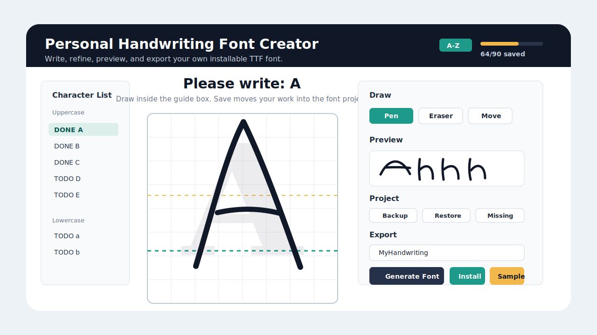
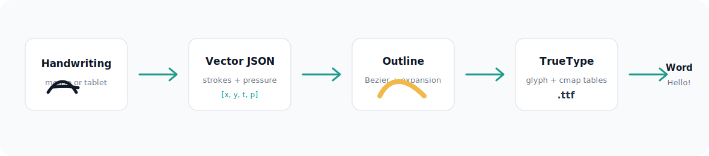

# Personal Handwriting Font Creator



Create a real installable TrueType font from handwriting drawn directly inside a desktop editor. The app stores every character as vector strokes, previews your handwritten text, and exports a `.ttf` file you can install and use in Microsoft Word, Pages, Keynote, Photoshop, or any app that supports system fonts.

## Highlights

- Direct handwriting canvas for uppercase letters, lowercase letters, numbers, and punctuation.
- Vector stroke storage in Unicode-safe `characters/*.json`, including point order, timestamp, and pressure.
- Built-in editing tools: pen, eraser, move, undo, redo, center, scale, nudge, clear, save, and save-next.
- Live handwriting preview from saved strokes.
- One-click font export with custom family name, output folder, and automatic HTML sample page.
- Convenient export actions: open generated font, install font, open output folder, and copy font path.
- Project backup and restore as portable `.zip` archives.
- Missing character report for finishing a usable font faster.
- TrueType generation with `fontTools`: glyph outlines, Unicode cmap, metrics, names, and font tables.

## How It Works



The font pipeline is fully local:

1. Draw a character in the canvas.
2. Save vector strokes as JSON.
3. Fit and sample smooth Bezier-like paths.
4. Expand strokes into filled glyph outlines.
5. Build a TrueType font with Unicode mappings.
6. Export a browser sample page and optional project backup.

## Quick Start

### macOS One-Click Launcher

Double-click:

```text
Run Personal Handwriting Font Creator.command
```

The launcher creates a virtual environment, installs dependencies, verifies imports, and starts the editor.

### Manual Run

```bash
git clone https://github.com/Kevin57890/personal-handwriting-font-creator.git
cd personal-handwriting-font-creator
python3 -m venv .venv
source .venv/bin/activate
python -m pip install --upgrade pip
python -m pip install -r requirements.txt
python main.py
```

Python 3.9 or newer is supported. Python 3.11 is recommended.

## Exporting A Font

1. Draw and save the characters you want.
2. Enter a font family name, for example `MyHandwriting`.
3. Choose an output folder or keep the default `output/`.
4. Click **Generate Font**.
5. Use **Install Font**, **Open Font**, or **Open Output** from the export panel.

After installation, select the font in Microsoft Word and type:

```text
Hello World!
```

The text will render using your handwritten glyphs for every saved character.

Every font export also creates:

```text
output/<FontName>-sample.html
```

Open the sample page in a browser to review your generated font, glyph coverage, and preview text before installing it everywhere.

## Project Management

- **Backup Project** writes a portable `.zip` archive containing saved character JSON and a manifest.
- **Restore Project** imports a backup and refreshes the editor.
- **Missing Report** writes a plain-text checklist of saved and missing characters.
- Character files use Unicode-based names, so uppercase and lowercase glyphs remain separate on case-insensitive file systems.
- Character JSON remains local by default and is ignored by git.

## Project Structure

```text
PersonalHandwritingFontCreator/
  main.py
  requirements.txt
  src/
    gui/
      main_window.py
      canvas.py
      styles.py
    editor/
      stroke_manager.py
    font/
      glyph_generator.py
      ttf_builder.py
    data/
      character_storage.py
      project_package.py
    utils/
      characters.py
  characters/
  output/
  tests/
```

## Stroke JSON Format

```json
{
  "character": "A",
  "unicode": "0041",
  "strokes": [
    [
      [104.0, 320.0, 1719991000.0, 1.0],
      [110.0, 301.0, 1719991000.1, 1.0]
    ]
  ]
}
```

Saved files use names such as:

```text
U+0041_LATIN_CAPITAL_LETTER_A.json
U+0061_LATIN_SMALL_LETTER_A.json
```

Each point is:

```text
[x, y, time, pressure]
```

Mouse input uses pressure `1.0`. Tablet input uses available device pressure.

## Tests

```bash
python -m unittest discover -s tests
```
